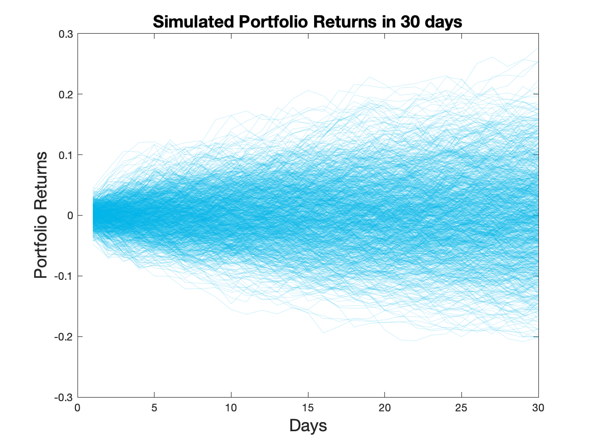
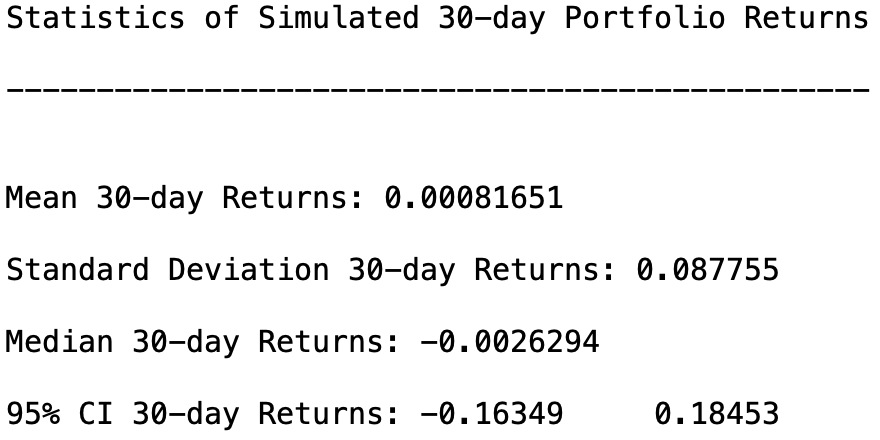

Monte Carlo Introduction
------------------------

The purpose of this tutorial is to demonstrate Monte Carlo Simulation in
Matlab, R, and Python. We conduct our Monte Carlo study in the context
of simulating daily returns for an investment portfolio.

For simplicity we will only consider three assets: Apple, Google, and
Facebook. We will assume an Initial Investment of $100,000 and allocate
our money evenly between the three stocks. In this case the portfolio
weights *w*<sub>*i*</sub> = 1/3 for *i* = 1, 2, 3.

Next, we assume that daily returns are distributed Multivariate Normal
with mean vector *μ* and covariance matrix *Σ*. In other words,
*R*<sub>*t*</sub> ∼ *M**V**N*(*μ*, *Σ*)
 for *t* ∈ {1, …, *T*} where *T* is the final time horizon.

We will use the Cholesky Factorization in order to find Lower Triangular
Matrix *L* such that *L**L*′ = *Σ*. Then our returns can be generated by
*R*<sub>*t*</sub> = *μ* + *L**Z*<sub>*t*</sub>
 where
*Z*<sub>*t*</sub> ∼ *N*(0, *I*)
 for *t* ∈ {1, …, *T*}.

The returns will be simulated over a 30-day period, where our 30-day
returns can be formulated as,
$$\\hat R\_{30} = \\prod\_{t=1}^{30} (1+R\_t)$$

Thus our portfolio returns for each Monte Carlo trial *m* become the
inner product between the 30-day returns and our vector of portfolio
weights *w*,
*P*<sub>*m*</sub> = *w* ⋅ *R̂*<sub>30</sub>
.

Dataset Summary
---------------

We use adjusted-close stock prices for Apple, Google, and Facebook from
November 14th, 2017 - November 14th, 2018. Historical stock price data
can be found on Yahoo Finance for these companies. Also here is the link
to the data set for this tutorial [‘Stock Price
Data’](https://raw.githubusercontent.com/ShuoranLi/506_Project/master/Group21_ProjectData.csv).

The first ten rows of data look like :

    ##         Date AAPL_Adj_Close GOOG_Adj_Close FB_Adj_Close
    ##  1: 11/15/17       166.5791        1020.91       177.95
    ##  2: 11/16/17       168.5693        1032.50       179.59
    ##  3: 11/17/17       167.6333        1019.09       179.00
    ##  4: 11/20/17       167.4658        1018.38       178.74
    ##  5: 11/21/17       170.5791        1034.49       181.86
    ##  6: 11/22/17       172.3721        1035.96       180.87
    ##  7: 11/24/17       172.3820        1040.61       182.78
    ##  8: 11/27/17       171.5150        1054.21       183.03
    ##  9: 11/28/17       170.5101        1047.41       182.42
    ## 10: 11/29/17       166.9732        1021.66       175.13

Languages
---------

### R

Firstly, we need to load the data

``` r
stock_Data = fread('./Group21_ProjectData.csv')
```

Then we extract the stock price and set initial values for Monte-Carlo
parameters

``` r
stock_Price = as.matrix( stock_Data[ , 2:4] )

mc_rep = 1000 # Number of Monte Carlo Simulations
training_days = 30 
```

Get the returns by stock price and set the investment weights

``` r
# This function returns the first differences of a t x q matrix of data
returns = function(Y){
  len = nrow(Y)
  yDif = Y[2:len, ] / Y[1:len-1, ] - 1
}

# Get the Stock Returns
stock_Returns = returns(stock_Price)

# Suppose we invest our money evenly among all three assets 
# We use today's Price 11/14/2018 to find the number of shares each stock 
# that we buy
portfolio_Weights = t(as.matrix(rep(1/ncol(stock_Returns), ncol(stock_Returns))))
print(portfolio_Weights)
```

    ##           [,1]      [,2]      [,3]
    ## [1,] 0.3333333 0.3333333 0.3333333

Calculate the Covariance matrix and Mean value of Stock Returns

``` r
# Get the Variance Covariance Matrix of Stock Returns
coVarMat = cov(stock_Returns)
miu = colMeans(stock_Returns)
# Extend the vector to a matrix
Miu = matrix(rep(miu, training_days), nrow = 3)
```

Use Monte-Carlo to simulate the 30-day Portfolio Returns

``` r
# Initializing simulated 30 day portfolio returns
portfolio_Returns_30_m = matrix(0, training_days, mc_rep)

set.seed(200)
for (i in 1:mc_rep) {
  Z = matrix ( rnorm( dim(stock_Returns)[2] * training_days ), ncol = training_days )
  # Lower Triangular Matrix from our Choleski Factorization
  L = t( chol(coVarMat) )
  # Calculate stock returns for each day
  daily_Returns = Miu + L %*% Z  
  # Calculate portfolio returns for 30 days
  portfolio_Returns_30 = cumprod( portfolio_Weights %*% daily_Returns + 1 )
  # Add it to the monte-carlo matrix
  portfolio_Returns_30_m[,i] = portfolio_Returns_30;
}
```

Visualising the result ( Simulated Portfolio Returns in 30 days)

``` r
# Visualising result
x_axis = rep(1:training_days, mc_rep)
y_axis = as.vector(portfolio_Returns_30_m-1)
plot_data = data.frame(x_axis, y_axis)
ggplot(data = plot_data, aes(x = x_axis, y = y_axis)) + geom_path(col = 'red', size = 0.1) +
  xlab('Days') + ylab('Portfolio Returns') + 
  ggtitle('Simulated Portfolio Returns in 30 days')+
  theme_bw() +
  theme(plot.title = element_text(hjust = 0.5))
```


Get some useful statistics through the results we get

``` r
# Porfolio Returns statistics on the 30th day.
Avg_Portfolio_Returns = mean(portfolio_Returns_30_m[30,]-1)
SD_Portfolio_Returns = sd(portfolio_Returns_30_m[30,]-1)
Median_Portfolio_Returns = median(portfolio_Returns_30_m[30,]-1)
print(c(Avg_Portfolio_Returns,SD_Portfolio_Returns,Median_Portfolio_Returns))
```

    ## [1]  0.0009402469  0.0840585273 -0.0015423606

``` r
# Construct a 95% Confidential Interval for average returns
Avg_CI = quantile(portfolio_Returns_30_m[30,]-1, c(0.025, 0.975))
print(Avg_CI)
```

    ##       2.5%      97.5% 
    ## -0.1541318  0.1702711

### Matlab

Load data and extract stock price

``` r
stockData = readtable('Group21_ProjectData.csv');
stockPrices = table2array(stockData(:, 2:end));
```

Set Monte\_Carlo parameters

``` r
mc_rep = 1000;
initInvestment = 100000;
numTradingDays = 30
```

Calculate stock returns

``` r
stock_returns = stock_price(2:end, :) ./ stock_price(1:end-1, :) - 1;
```

Set portfolio weight

``` r
portfolioWeights = (1/3) * ones(1, size(stockPrices,2));
```

Calculate covariance matrix and mean of the stock returns

``` r
% Get the Variance Covariance Matrix of our Stock Returns
coVarMat = cov(stockReturns);

% Average returns of each asset 
mu = transpose(mean(stockReturns));
mu = repmat(mu, 1, numTradingDays);
```

Then we use Monte-Carlo to simulate the portfolio returns in 30 days

``` r
for i = 1:mc_rep
    % 'Randomly generated numbers from N(0,1) distribution'
    Z = randn(size(stockReturns,2), numTradingDays);

    % 'Lower Triangular Matrix from Choleski Factorization'
    L = chol(coVarMat, 'lower');

    % 'Calculate daily returns for 30 days'
    dailyReturns = mu + (L * Z);

    % 'Portfolio Returns'
    thirtyDayReturn = transpose(cumprod(portfolioWeights * dailyReturns + 1));
    
    % 'Add return to the set of all 30-day portfolio returns'
    portfolio30DayReturn_m(:,i) = thirtyDayReturn;
end
```

Visualizing the result

``` r
plot(portfolio30DayReturn_m - 1, 'LineWidth', 0.5, 'Color', [0,0.7,0.9, 0.2])
title('Simulated Portfolio Returns in 30 days', 'fontsize', 16)
xlabel('Days','fontsize',16)
ylabel('Portfolio Returns','fontsize',16)
```

 Finally, we want to
get some useful statistics:

``` r
% Calculate some statistics for our simulated portfolio returns
averagePortfolioReturns = mean(portfolio30DayReturn_m(end,:) - 1);
stdDevPortfolioReturns = std(portfolio30DayReturn_m(end,:) - 1);
medianPortfolioReturns = median(portfolio30DayReturn_m(end,:) - 1);

% Construct a 95% Confidential Interval for average returns

average_CI = quantile(portfolio30DayReturn_m(end,:) - 1, [0.025, 0.975]);
```



### Python

Load modules

``` r
import pandas as pd
import numpy as np
import matplotlib.pyplot as plt
```

Load data and extract stock price

``` r
stock_data = pd.read_csv("Group21_ProjectData.csv")
stock_price = stock_data.iloc[:,1:4]
stock_price = stock_price.values
```

Set Monte\_Carlo parameters

``` r
mc_rep = 1000
train_days = 30
```

Calculate stock returns

``` r
nrows = len(stock_price)
stock_returns = stock_price[1:nrows,:] / stock_price[0:nrows-1,:] - 1
```

Set portfolio weight

``` r
portf_WT = np.array([1/3, 1/3, 1/3])
```

Calculate covariance matrix and mean of the stock returns

``` r
cov = np.cov(np.transpose(stock_returns))
miu = np.mean(stock_returns, axis=0)
Miu = np.full((train_days,3),miu)
Miu = np.transpose(Miu)
```

Then we use Monte-Carlo to simulate the portfolio returns in 30 days

``` r
# initial matrix
portf_returns_30_m = np.full((train_days,mc_rep),0.)

np.random.seed(100)
for i in range(0,mc_rep):
    Z = np.random.normal(size=3*train_days)
    Z = Z.reshape((3,train_days))
    L = np.linalg.cholesky(cov)
    daily_returns = Miu + np.inner(L,np.transpose(Z))
    portf_Returns_30 = np.cumprod(np.inner(portf_WT,np.transpose(daily_returns)) + 1)
    portf_returns_30_m[:,i] = portf_Returns_30
```

Visualizing the result

``` r
plt.plot(portf_returns_30_m)
plt.ylabel('Portfolio Returns')
plt.xlabel('Days')
plt.title('Simulated Portfolio Returns in 30 days')
plt.show()
```

 Finally, we want to get some
useful statistics:

``` r
# Porfolio Returns statistics on the 30th day
Avg_portf_returns = np.mean(portf_returns_30_m[29,:]-1)
SD_portf_returns = np.std(portf_returns_30_m[29,:]-1)
Median_portf_returns = np.median(portf_returns_30_m[29,:]-1)
print(Avg_portf_returns)
print(SD_portf_returns)
print(Median_portf_returns)
```


``` r
# construct CI for average
Avg_CI = np.quantile(portf_returns_30_m[29,:]-1,np.array([0.025,0.975]))
print(Avg_CI)
```


Results
-------

For our particular example, the portfolio returns averaged over all
monte carlo trials had an average close to 0. The reason the average is
close to 0 is because Apple, Facebook, and Google have average returns
close to 0 over the past year. Therefore, our simulated returns
essentially had no drift. Also, assuming a normal distribution of the
returns would not work well in practice since stock returns are
typically fat-tailed and not normally distributed. However, based on our
Monte Carlo Study, we do not suggest investing in this portfolio based
on the low expected portfolio returns.

Note
----

Statistics we get using three different languages are slightly
different, because in our simulation process, we have generated random
numbers and these numbers cannot be exactly identical.

Reference
---------

*Yahoo Finance*
